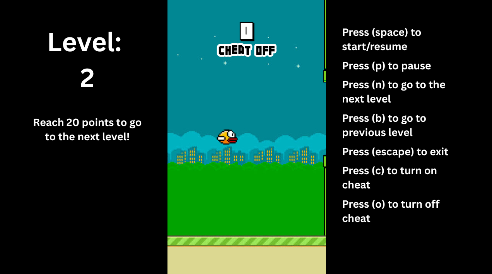
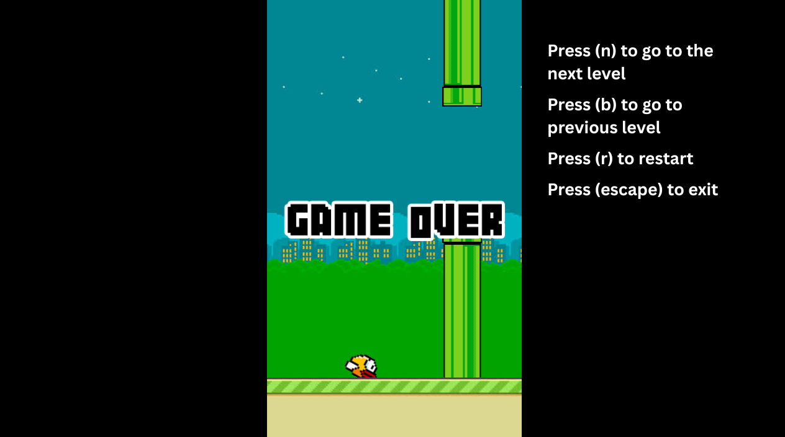
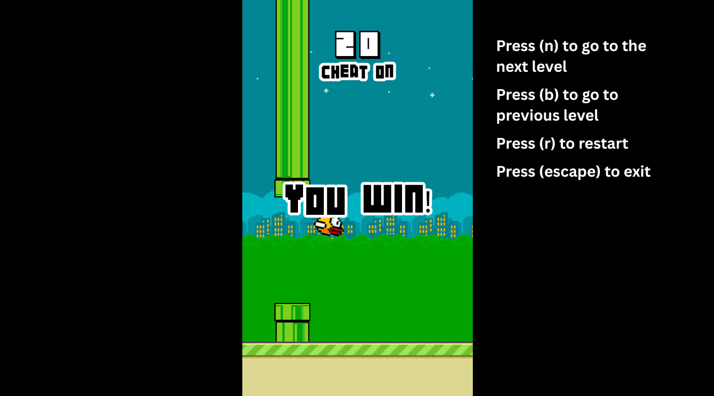

# 2025 OOPL Final Report

## 組別資訊

組別：37 \
組員：施孝健 112590040 \
復刻遊戲：Flappy Bird Go

## 專案簡介

### 遊戲簡介
Flappy Bird Go is a remake of the classic Flappy Bird game featuring significant enhancements. The core gameplay—tapping to flap and avoid pipes—remains, but the game introduces 10 progressively challenging levels, each adding new mechanics such as vertical pipe movement, blinking pipes, adjacent pipes, and reverse gravity. This structure enriches the player experience and tests adaptability.
### 組別分工
施孝健: Planning, design, programming, testing, and documentation.

## 遊戲介紹

### 遊戲規則
- Control the bird by pressing Space to flap.
- Avoid hitting pipes; each passed pipe earns 1 point.
- Reach 20 points to clear a level.
- The game has 10 levels, with escalating difficulty and mechanics:

| Level | Features  |
|-------|---|
| 1     | Standard Flappy Bird gameplay  |
| 2     | Pipes move vertically  |
| 3     | Adjacent pipes with narrow vertical gaps |
| 4     | Blinking pipes (appear/disappear)  |
| 5     | Reverse gravity (bird flies upward by default)  |
| 6     | Vertical moving pipes + Blinking  |
| 7     | Adjacent pipes + Blinking  |
| 8     | Vertical moving pipes + Reverse gravity  |
| 9     | Adjacent pipes + Reverse gravity  |
| 10    | Vertical moving + Blinking + Reverse gravity  |

- Controls

| Key    | Action  |
|--------|---|
| Space  | Start / Resume / Flap  |
| P      | Pause  |
| N      | Skip to next level (levels 1-9)  |
| B      | Go back to previous level (levels 2-10)  |
| Escape | Exit the game  |
| C      | Enable cheat mode (disable collisions)  |
| O      | Disable cheat mode  |
| R      | Restart current level (after game over or win)  |

### 遊戲畫面

- Left Panel:
  - Show the current level
  - Objective: Reach 20 points to go to the next level!
- Center:
  - Show the current score
  - Show that cheat mode is enabled/disabled.
- Right Panel (Controls):
  - Press (space) to start/resume
  - Press (p) to pause
  - Press (n) to go to the next level
  - Press (b) to go to the previous level
  - Press (escape) to exit
  - Press (c) to turn on cheat
  - Press (o) to turn off cheat
  

- Center:
  - Message: GAME OVER
  - The bird has crashed into a pipe and fallen to the ground.
- Right Panel (Controls):
  - Press (n) to go to the next level
  - Press (b) to go to the previous level
  - Press (r) to restart
  - Press (escape) to exit

- Center:
  - Show the winning score: 20
  - Show that cheat mode is enabled/disabled.
  - Message: YOU WIN!
- Right Panel (Controls):
  - Press (n) to go to the next level
  - Press (b) to go to the previous level
  - Press (r) to restart
  - Press (escape) to exit

## 程式設計

### 程式架構
- Modular C++ design using classes like App, Character, and AnimatedCharacter.
- Game states managed through a unified system: Preparation, Running, and GameOver phases for each level.
- Separate source files handle level-specific logic, allowing clean organization and scalability.

### 程式技術
- Consistent Level Architecture: \
  Each level is implemented with a clear modular structure consisting of three main functions:
    - Level_X_Start() — initializes the level, UI, and variables
    - Level_X_Update() — contains the main game loop logic, handling input, pipe and bird movements, collision detection, scoring, and state changes
    - Level_X_GameOver() — manages the game over state with UI feedback and input handling for restart, level navigation, and exit
- Game State and Input Management: \
  The game flow is controlled by a state machine pattern using enums to switch between different game states such as start, running, winning, game over, and end. Player inputs (pause, resume, next/previous level, cheat mode toggles, restart, exit) are captured and processed within each update function for smooth control and responsiveness.
- Dynamic Pipe Behaviors: \
  Each level introduces unique pipe mechanics—such as vertical oscillation, blinking visibility, adjacent pipe placement, or reverse gravity—implemented within the update functions. Pipe positions update every frame based on level-specific logic to increase difficulty progressively.
- Collision Detection with Cheat Mode: \
  Collision detection occurs every frame to check bird interactions with pipes and boundaries. A cheat mode toggle disables collisions, facilitating debugging and offering gameplay flexibility.
- Scoring and UI Feedback: \
  Scores increment as the bird successfully passes pipes, triggering sound effects and dynamic UI updates. Point display, game over messages, and victory screens are managed by toggling UI element visibility based on the current game state.
- Boundary Enforcement: \
  The bird’s vertical movement is constrained within predefined screen limits. Crossing these boundaries (except when cheating) triggers game over.
- Audio Integration: \
  Sound effects for flapping, scoring, collisions, game start, and other events enhance gameplay experience and user feedback.
- Layered UI and Resource Management: \
  Each level manages its own visual elements such as backgrounds, pipe sprites, and overlays through a scene graph structure. Elements are added or removed dynamically to reflect game progression.

## 結語

### 問題與解決方法
- Code Duplication: Refactored repeated bird movement code into a single parameterized function to support gravity modes.
- Memory Management: Identified and fixed memory leaks through thorough cleanup and use of destructors.
- Collision Issues: Improved collision detection by refining bounding boxes and logic.
- Performance Optimization: Enhanced pipe update routines to reduce frame drops and maintain smooth gameplay.

### 自評

| 項次 | 項目                   | 完成 |
|------|------------------------|----|
| 1    | 這是範例 | V  |
| 2    | 完成專案權限改為 public | V  |
| 3    | 具有 debug mode 的功能  | V  |
| 4    | 解決專案上所有 Memory Leak 的問題  | V  |
| 5    | 報告中沒有任何錯字，以及沒有任何一項遺漏  | V  |
| 6    | 報告至少保持基本的美感，人類可讀  | V  |

### 心得
This project was an excellent opportunity to apply object-oriented programming principles in a real-world game scenario. Designing and managing multiple challenging levels deepened my understanding of state management and modular design. Implementing features like blinking pipes and reverse gravity expanded my problem-solving skills and strengthened my ability to write scalable, maintainable code.

### 貢獻比例
施孝健 - 100%